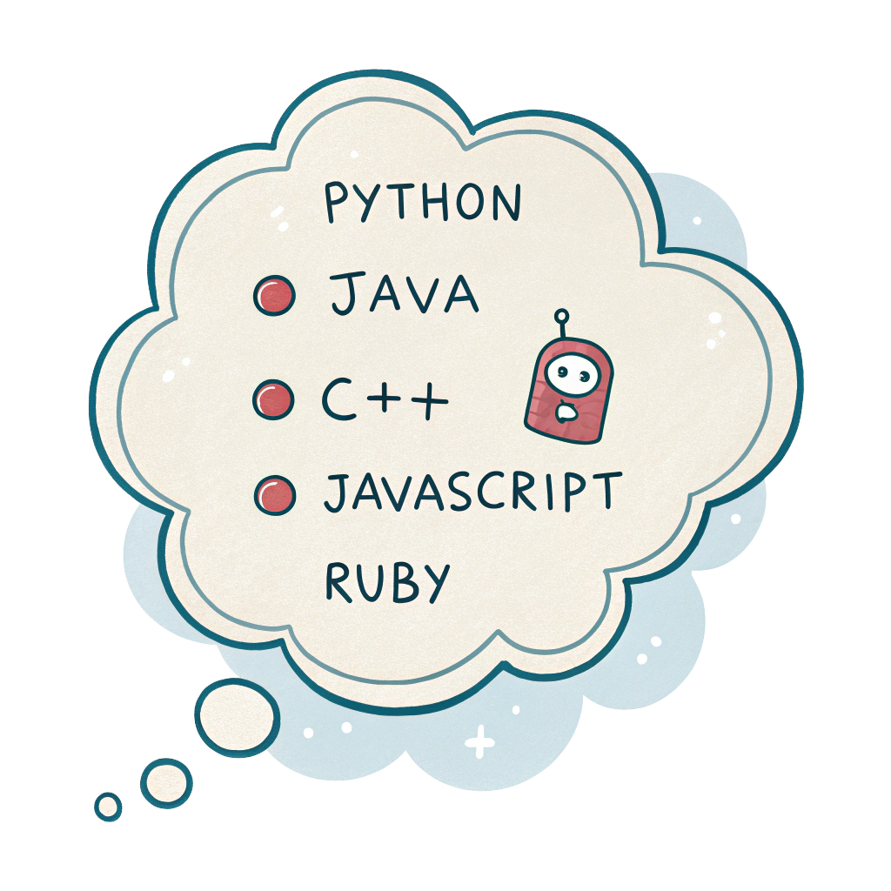

# Programming Languages Popularity Tracker



## What is this project?

This is an interactive dashboard that explores trends across a range of programming languages. It brings together data on how developers feel about different languages (admired vs. desired), how those languages compare in terms of salary, how their popularity has shifted over time, and where they’re most used across industries.

## Why did I build this?

I’ve always been curious about how the tools we use as developers reflect larger trends in the tech world. What languages are loved but not used? Which ones pay well? Are some growing while others fade out? I wanted to build something that answers these questions in a way that’s not overwhelming — something you could actually explore and learn from, even if you're not a data scientist.

## How did I build it?

The dashboard was built using:
- **Python** for all data processing and transformation
- **Pandas** for wrangling and merging multiple datasets
- **Plotly** for interactive charts and visualizations
- **Streamlit** to create the web-based dashboard interface

I pulled data from multiple sources, including developer surveys and public wage datasets, and merged them to show patterns that are often scattered across the internet. Each section of the dashboard focuses on a specific angle — admiration vs. desire, salary insights, decade-long shifts in popularity, and usage by industry.

---

### Tools Used

- Python
- Pandas
- Plotly
- Streamlit
- Canva (for the project thumbnail)

---

### Data Sources

- [Stack Overflow Developer Survey 2024 – Admired & Desired](https://survey.stackoverflow.co/2024/technology#admired-and-desired)  
- [Statista – Most Used Programming Languages by Developer Type](https://www.statista.com/statistics/793628/worldwide-developer-survey-most-used-languages/)  
- [DevJobsScanner – Top 10 Highest Paid Programming Languages](https://www.devjobsscanner.com/blog/top-10-highest-paid-programming-languages/)  
- [DataUSA – Programming Salaries by Industry](https://datausa.io/profile/soc/computer-engineering-science-occupations#occupation-by-industry)  
- [TIOBE Index – Global Programming Popularity](https://www.tiobe.com/tiobe-index/)  
- [PYPL – Popularity of Programming Languages](https://pypl.github.io/PYPL.html)  
- [Reddit – Emerging Programming Markets](https://www.reddit.com/r/AskProgramming/comments/17ex3lg/programming_languages_with_the_highest_labor/)  
- [Red Global – US Tech Job Market Analysis](https://www.redglobal.com/news-blog/the-us-tech-job-market-unveiled-)  
- [Reddit – Countries with Famous Programming Languages](https://www.reddit.com/r/dataisbeautiful/comments/vpci9j/countries_that_have_created_worldfamous/)


---

### Features

- *Interactive dropdown* to explore admiration, desire, and salary for a specific language
- *Historical comparison chart* showing how language popularity changed from 2014 to 2024
- *Industry usage panel* showing where each language is most commonly used
- *Clean reflections section* to summarize key insights and learnings

---

### Want to try it?

Clone the repo, install the requirements, and run:
```bash
streamlit run app.py
