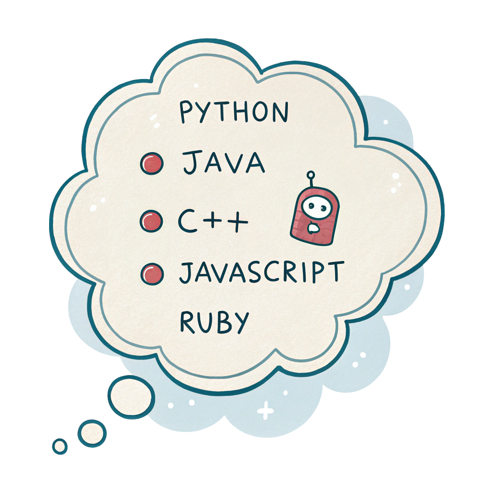
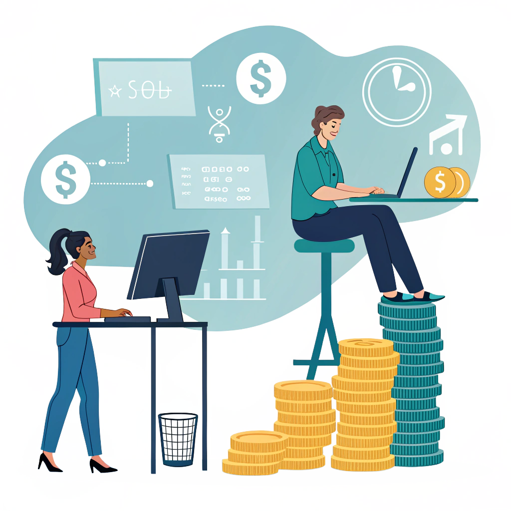

# Data Visualization Portfolio

## About Me
Hey, I’m Saleha :)
I am currently studying Computer Science with minors in Data Science and Math, but beyond the assignments and code, I am just someone who loves making things. Whether it is a warm loaf of banana bread or a dashboard that brings a dataset to life, I enjoy creating and exploring.

I really enjoy working with data because it feels like solving little mysteries. I like finding patterns, asking good questions, and turning numbers into stories. I also love building things that people can actually use, which is why I am hoping to become a software engineer one day. I am especially interested in areas like AI and tools that make life a little easier or more meaningful.

This past couple months, I have also been bringing one of my dream projects to life: Fuerza, a social media app built for lifters and fitness lovers to share progress, connect, and stay motivated. It’s been such a fun challenge that mixes design, backend logic, and everything in between. It reminds me why I love this work so much.

When I am not coding, I am probably baking, making reels no one asked for, or thinking about tech ethics and how we can use this field for good.

This portfolio is a mix of what I have been learning, building, and figuring out. Thanks for being here!!

Welcome to my data visualization portfolio! Here, you'll find a collection of projects showcasing my skills in data analysis and visualization. I am passionate about turning data into meaningful insights and compelling visuals.

<!--Include links to documents or sites that may be useful to your target audience: website, LinkedIn, your cv/resume, github, a community you contribute to, etc -->

To learn more about me, you can visit my [instagram](https://www.instagram.com/salehaa2.0/), my [baking blog](https://www.instagram.com/thecupcakenationn/), my [github](https://github.com/salehaiftikharr), or read my [CV](images/CV.pdf).

---

## Programming Languages Tracker - Dashboard

<table align="left" style="border-collapse: collapse; border: none;">
    <tr style="border: none;">
        <td style="padding: 10px; width:25%; border: none;"> 
            
        </td>
        <td style="padding:10px; width:75%; border: none;" valign="top">
            

            This dashboard explores how developers feel about different programming languages, how much those languages pay, and where they’re most used. 
            I built it because I have always been curious about how technical tools shape careers and communities, and I wanted to make that data easy to understand and explore. 
            The goal was to bring together admiration, desire, salary, popularity shifts, and industry usage in one place where others could explore the trends too.
              
            <a href="./Project 1/README.md">Learn more</a>
              
            <i>Tools used: Python, Pandas, Plotly, Streamlit</i>
            

        </td>
    </tr> 
</table>

## Tech Needs More Women — Infographic

<table align="left" style="border-collapse: collapse; border: none;">
    <tr style="border: none;">
        <td style="padding: 10px; width:25%; border: none;"> 
            
        </td>
        <td style="padding:10px; width:75%; border: none;" valign="top">
            

            This is an infographic I created to highlight the gender disparities in tech — from wage gaps to promotion barriers to representation in computer science programs. 
            Being a woman in tech myself, this project means a lot to me. I’ve experienced some of these challenges firsthand, and I wanted to create something that could help others understand them at a glance. 
            It was my way of combining data, design, and advocacy to tell a story that needs more attention.
              
            <a href="./Project 2/README.md">Learn more</a>
              
            <i>Tools used: Python, Pandas, Matplotlib, Canva, Recraft.ai</i>
            

        </td>
    </tr> 
</table>

## Wage Gaps by Industry — Remix Visualization

<table align="left" style="border-collapse: collapse; border: none;">
    <tr style="border: none;">
        <td style="padding: 10px; width:25%; border: none;"> 
            
        </td>
        <td style="padding:10px; width:75%; border: none;" valign="top">
            

            This was a recreate-and-remix project where I redesigned a wage ranking chart from Data USA. The original graphic listed job titles by income, but I wanted to make it easier to compare industries and highlight wage differences more clearly.
              
            In my version, I grouped occupations by industry and color-coded them for visual clarity. I also showed how each job’s salary compares to the overall median wage, which gives a better sense of which roles are underperforming or overperforming financially. This remix was all about making the data more intuitive, informative, and accessible to a broader audience.
              
            <a href="./Project 3/README.md">Learn more</a>
              
            <i>Tools used: Python, Pandas, Matplotlib</i>
            

        </td>
    </tr> 
</table>
